# PRÁCTICA CI/CD
*Santiago Córdoba Herrera*

## 1. Fork del repositorio
Se realizó un fork del repositorio [base](https://github.com/leonjaramillo/protobootapp)

## 2. Integración Continua con Github Actions
Se utilizó el workflow *Java CI with Maven* que ya estaba creado desde el repositorio base

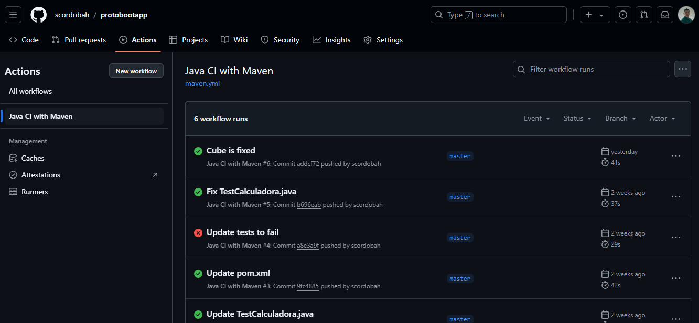

### 2.1. Escenarios
#### a) Build tras commit a rama master

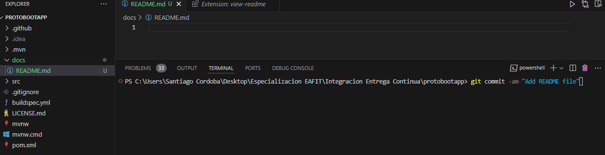

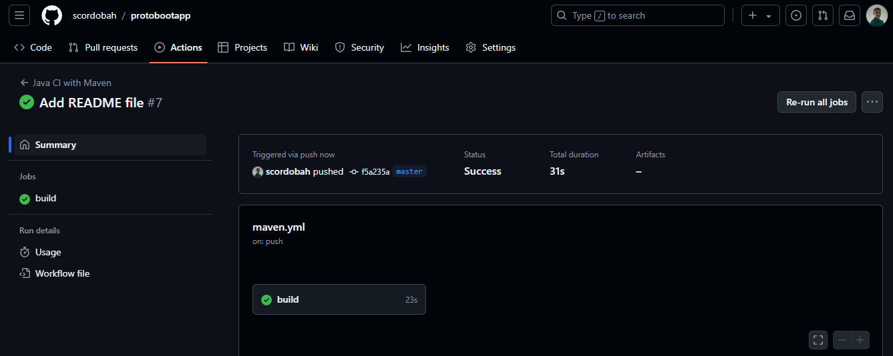

#### b) Error en el build tras error en prueba unitaria

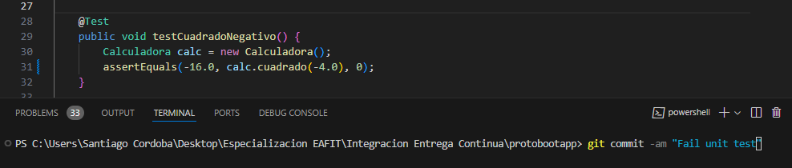

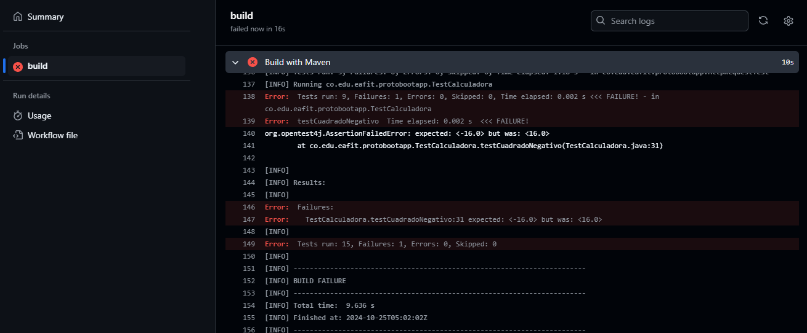

#### c) Error en el build tras error en prueba de integracion

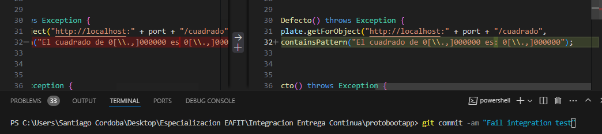

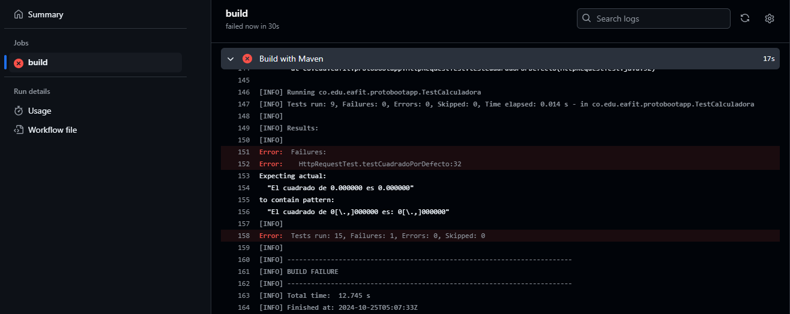

#### b) Error por validación del estilo o formato

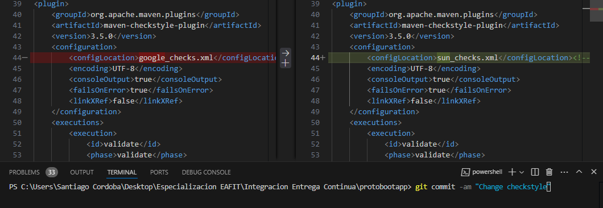

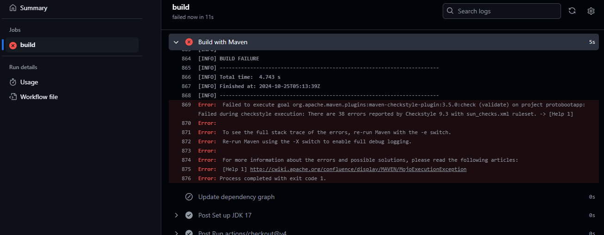

## 3. Integración Continua con Jenkins
### 3.1. Escenarios
#### a) Error en el build tras error en prueba unitaria
Se aprovecha el mismo commit de Github Actions

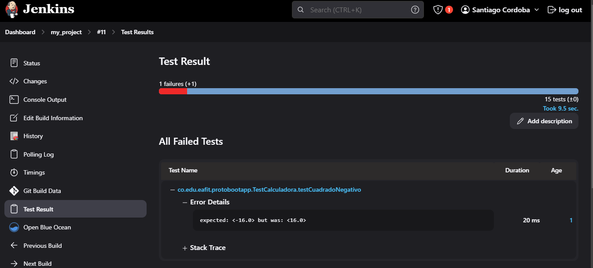

#### b) Error en el build tras error en prueba de integracion
Se aprovecha el mismo commit de Github Actions

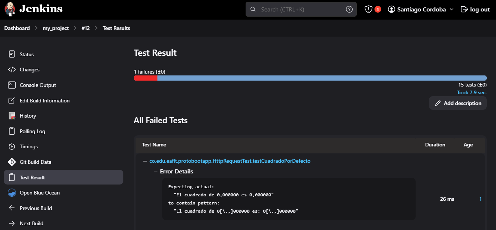

#### c) Error por validación del estilo o formato
Se aprovecha el mismo commit de Github Actions

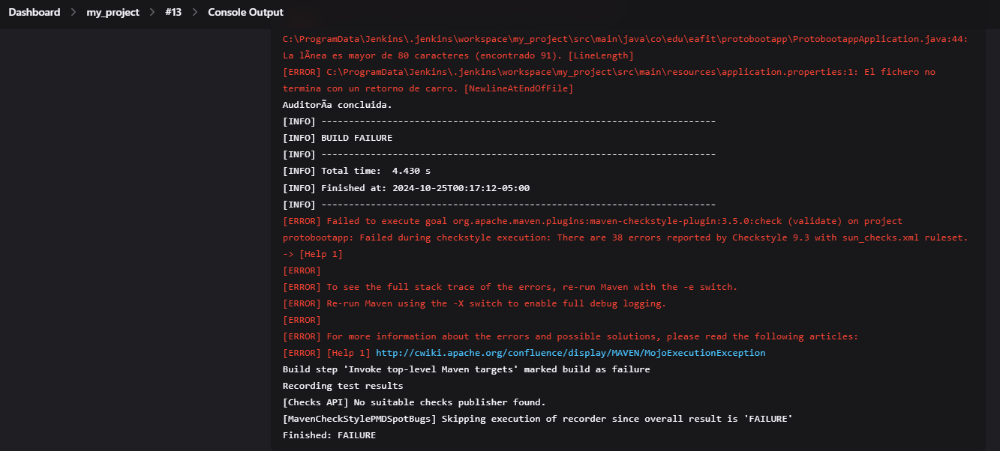

#### d) Error por incumplimiento con el limite de Code Coverage
Se aprovecha el mismo commit de Github Actions

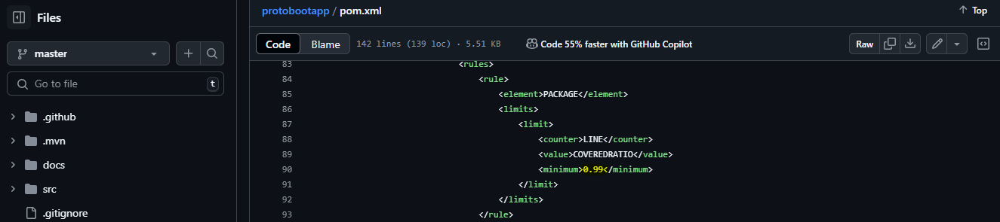

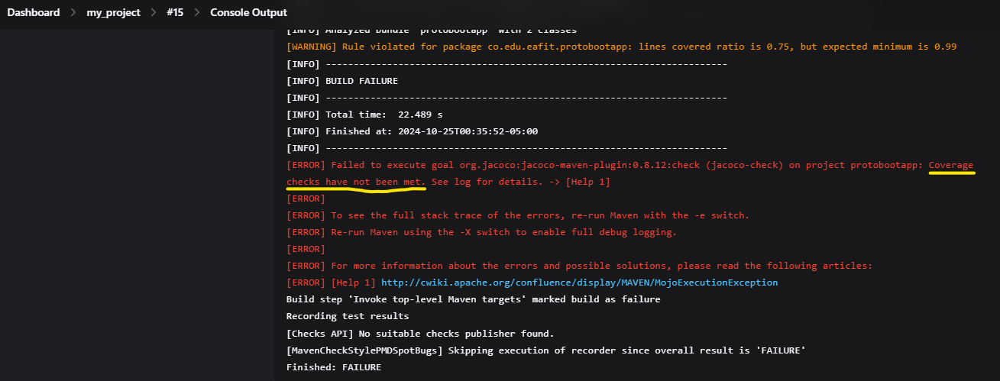

### 3.2. Visualización en Blue Ocean

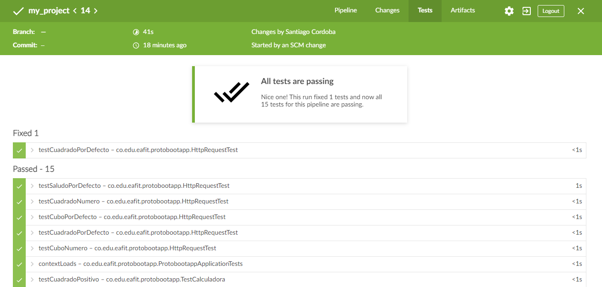

## 4. Despliegue continuo con AWS
### 4.1. Creación de ambientes

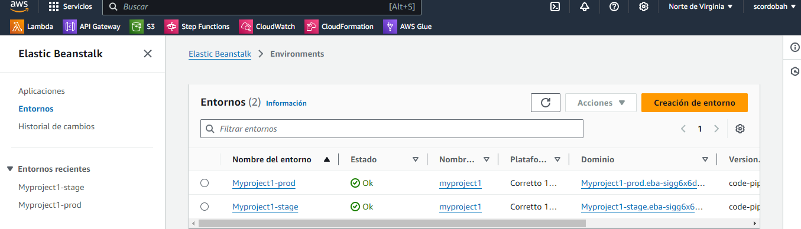

### 4.2. Escenarios
#### a) Error en el build tras error en prueba unitaria

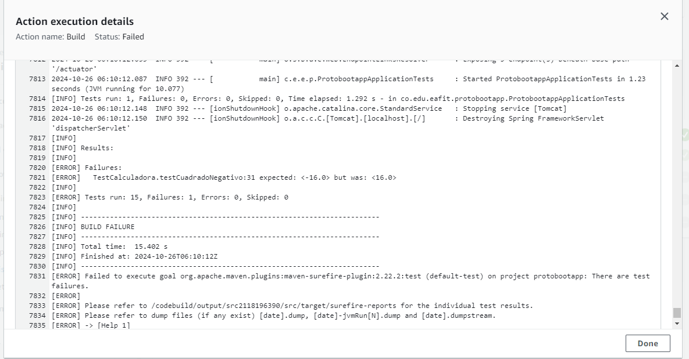

#### b) Error en el build tras error en prueba de integracion

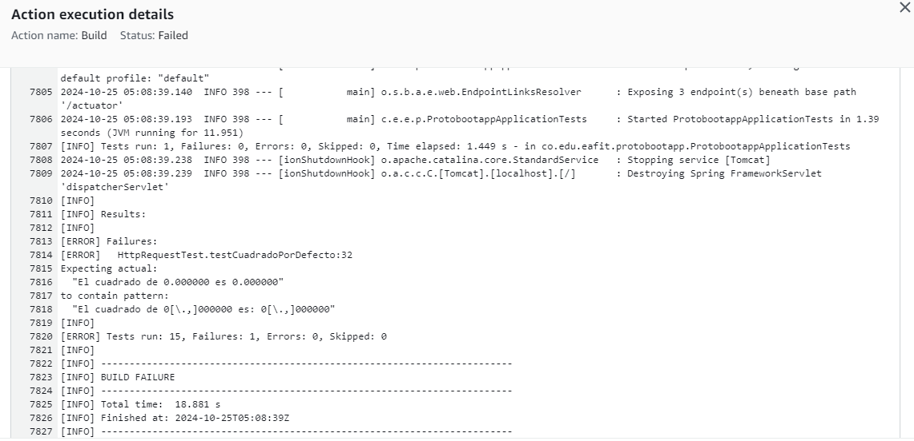

#### c) Error por validación del estilo o formato

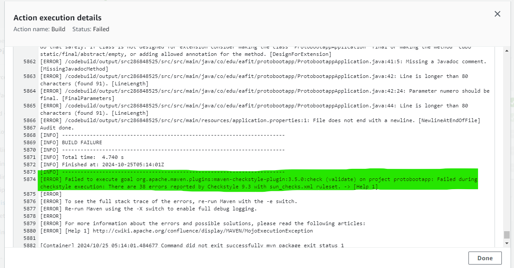

#### d) Error por incumplimiento con el limite de Code Coverage

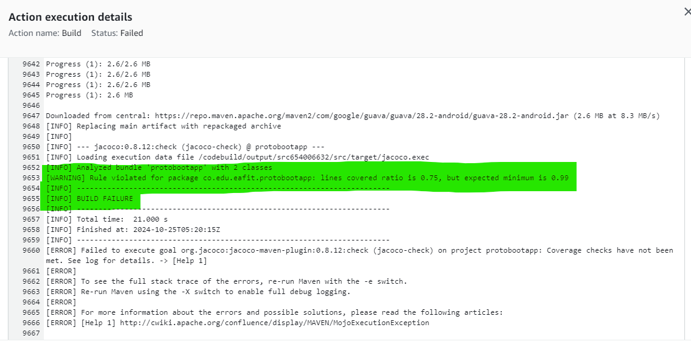

### 4.3. URLs Spring Boot Actuator

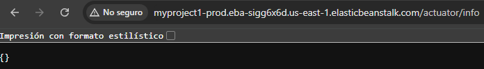

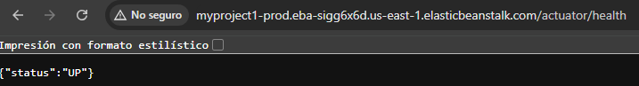

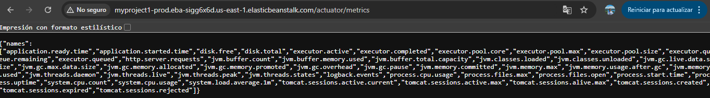

### 4.4. CloudWatch

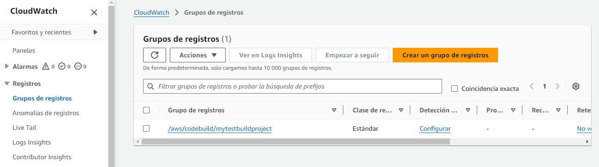

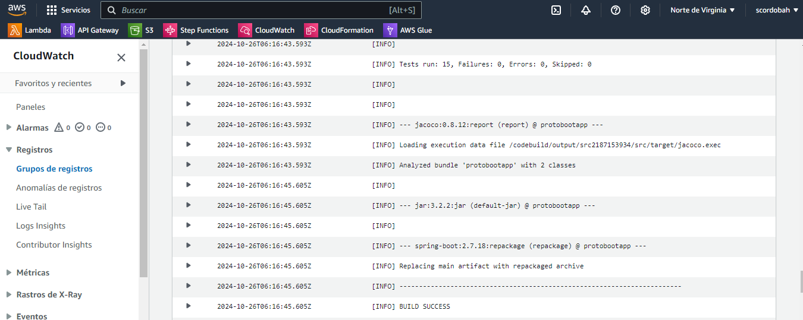

### 4.5. Reportes CodeBuild

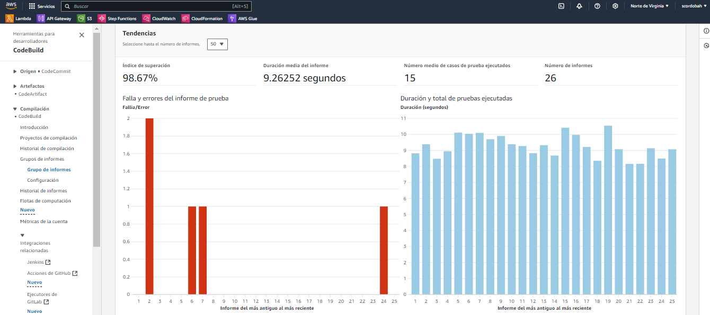

